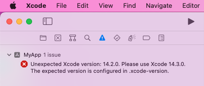

# xcode-version-check

Checks the actual Xcode version against the version specified in a `.xcode-version` file.

Emits:
* error: when `actual-version < expected-version`
* warning: when `actual-version > expected-version`



## Why would I want to use this?

Ensure that all developers on your team, and your CI, builds the app with the same Xcode version.

## Example Usage

1. Copy the file `xcode-version-check` to a `scripts` folder at the root of your project
2. In your Xcode project, add a Run Script build phase with the following content:
```sh
$PROJECT_DIR/scripts/xcode-version-check
```
3. Add a `.xcode-version` file to the root of your project. It should specify the
expected Xcode version as `MAJOR.MINOR.PATCH`. For example:
```
14.2.0
```
